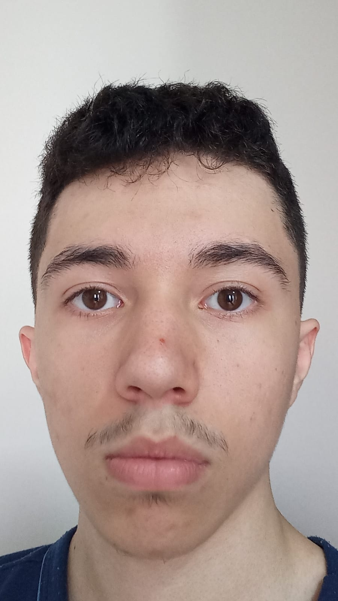

# 🛰️ ÓRBITA — Economia Espacial Inteligente

> Plataforma de inteligência satelital que conecta dados da NASA, ESA e INPE à economia real.

---

## 📋 Descrição

A **ÓRBITA** é uma solução digital desenvolvida para a **Global Solution 2026 da FIAP**, com o tema *O Espaço é a Nova Fronteira*. O projeto conecta dados satelitais abertos a usuários reais — agricultores, gestores de crise e tomadores de decisão — por meio de quatro módulos:

- 🌱 **Agro & Clima** — monitoramento de culturas e previsão de desastres
- 🌐 **Conectividade Emergencial** — comunicação via satélite LEO em crises
- 🤖 **IA Espacial** — detecção de desmatamento e análise de emissões
- 🚀 **Novos Negócios** — turismo orbital, mineração e colonização

Contribui com os **ODS 2, 9, 11 e 13** da Agenda 2030 da ONU.

---

## 🖥️ Tecnologias

| Tecnologia | Uso |
|---|---|
| HTML5 semântico | Estrutura das páginas |
| CSS3 | Estilização, responsividade, animações |
| JavaScript puro | Interatividade, validação, abas, eventos |
| Google Fonts | Tipografia (Syne + DM Sans) |

> Nenhum framework externo foi utilizado, conforme os critérios da disciplina.

---

## 📁 Estrutura de Pastas

```
orbita-project/
├── index.html           → Página inicial
├── solucao.html         → Apresentação da solução (página extra 1)
├── plataforma.html      → Demonstração interativa (página extra 2)
├── sobre.html           → Sobre o projeto
├── faq.html             → Perguntas frequentes
├── contato.html         → Formulário de contato
├── integrantes.html     → Desenvolvedor
├── README.md            → Documentação do projeto
├── integrantes.txt      → Identificação do aluno
│
├── css/
│   ├── style.css        → Todos os estilos do projeto
│   └── responsivo.css   → Media queries (mobile, tablet e desktop)
│
├── js/
│   ├── principal.js     → Navbar e menu hambúrguer
│   ├── interativo.js    → Abas da plataforma e acordeão do FAQ
│   └── formulario.js    → Validação do formulário de contato
│
└── assets/
    └── giovanni.jpg     → Foto do desenvolvedor
```

---

## 🖼️ Imagens do Projeto



---

## 👤 Desenvolvedor

| | |
|---|---|
| **Nome** | Giovanni de Souza Lima |
| **RM** | 556536 |
| **Turma** | 1TDSPI-2026 |
| **GitHub** | [github.com/GiovanniSouzaL](https://github.com/GiovanniSouzaL) |
| **LinkedIn** | [linkedin.com/in/giovanni-de-souza-lima-2770943b5](https://www.linkedin.com/in/giovanni-de-souza-lima-2770943b5/) |

---

## 🔗 Repositório

[github.com/GiovanniSouzaL/Projeto-orbital-gs](https://github.com/GiovanniSouzaL/Projeto-orbital-gs)

---

## 📬 Contato

- **Instituição:** FIAP — Faculdade de Informática e Administração Paulista
- **Curso:** Análise e Desenvolvimento de Sistemas — 1TDSPI-2026
- **Evento:** Global Solution 2026

---

*© 2026 ÓRBITA — FIAP Global Solution · Giovanni de Souza Lima · RM 556536*
